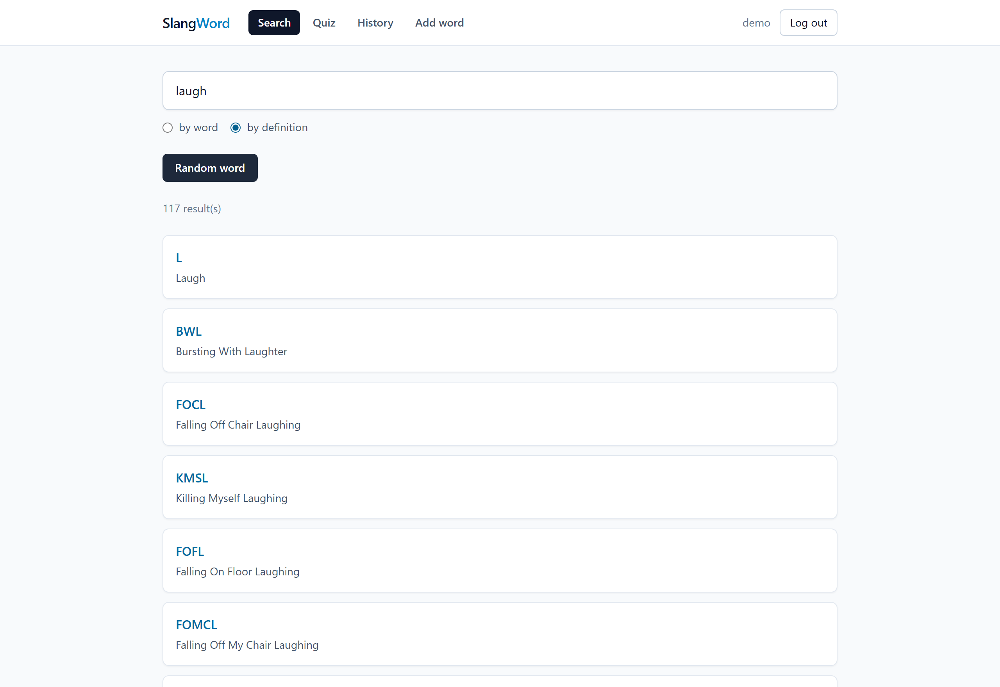
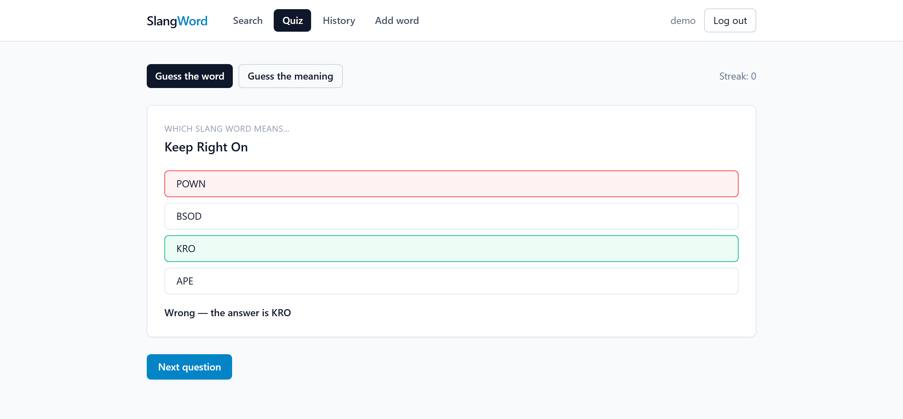
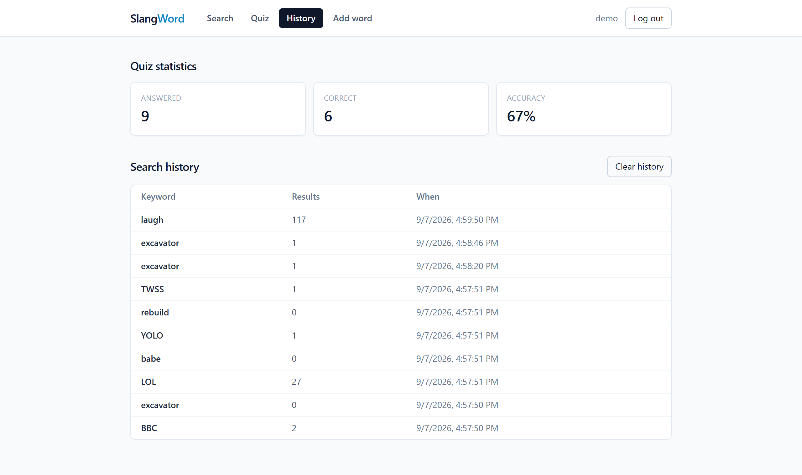
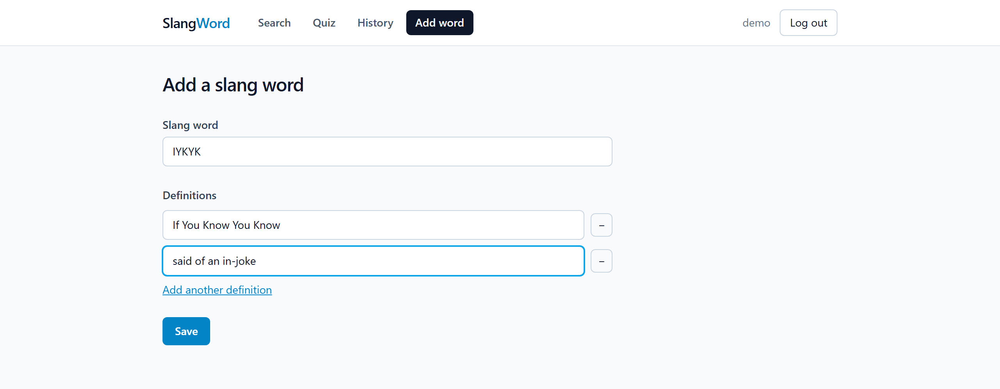
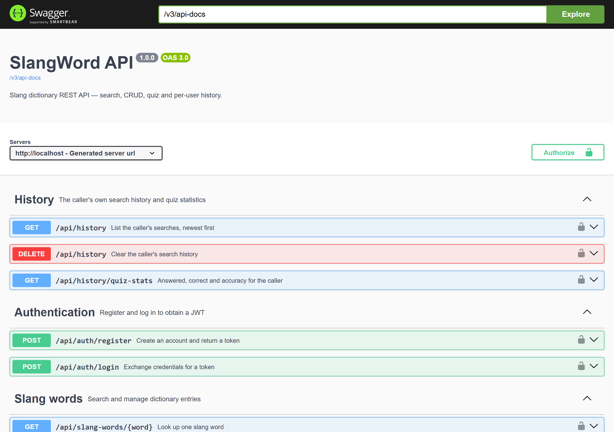
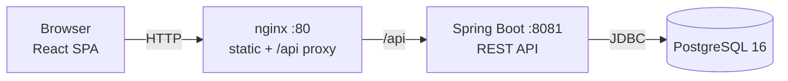
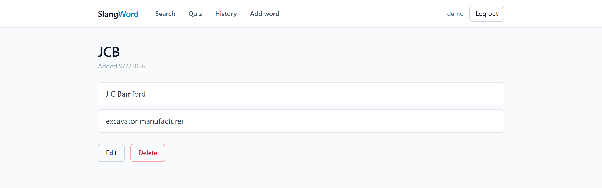

# SlangWord

A slang dictionary you can search, edit and quiz yourself on — Spring Boot REST API, React SPA, PostgreSQL, running from one command.

The dictionary ships with **7,641 real entries**, seeded from the original coursework data file.



<table>
<tr>
<td width="50%"><br><em>Quiz — four options, graded instantly, both directions</em></td>
<td width="50%"><br><em>Per-user search history and quiz statistics</em></td>
</tr>
<tr>
<td><br><em>Add a word with any number of definitions</em></td>
<td><br><em>Every endpoint documented via springdoc-openapi</em></td>
</tr>
</table>

---

## From coursework to platform

This repository started as a single-file Java Swing desktop app (`SlangDictionaryApp.java`, 350 lines) that read a backtick-delimited text file. It worked, and it is kept unchanged in [`legacy-swing/`](legacy-swing/) as the starting point.

The current version keeps the same domain and rebuilds it the way the problem would actually be solved in production:

| | Swing version | This version |
|---|---|---|
| Storage | `HashMap` + rewrite `slang.txt` on every change | PostgreSQL, Flyway migrations, JPA one-to-many |
| Access | One desktop user | REST API + web SPA, multi-user with JWT |
| History | In-memory list, lost on exit | Per-user, persisted, paginated |
| Duplicate word | Modal dialog | `409 Conflict`, `?overwrite=true` to confirm |
| Errors | `JOptionPane.showMessageDialog` | RFC 7807 `ProblemDetail` responses |
| Tests | None | 71 (31 unit, 40 integration with Testcontainers) + 8 frontend, 91.2% coverage |
| Run it | `javac` and hope | `docker compose up` |

---

## Architecture



Backend layering — each layer depends only on the one below it, and business rules live in services so they can be tested without Spring:

```
web/          controllers, DTO mapping, @RestControllerAdvice
service/      business rules  ← unit-tested with Mockito
repository/   Spring Data JPA
domain/       JPA entities
security/     JWT filter, user details, entry point
config/       beans and @ConfigurationProperties
```

## Tech stack

| Layer | Choices |
|---|---|
| Backend | Java 21, Spring Boot 3.5, Spring MVC, Spring Data JPA, Spring Security, JJWT, Flyway, springdoc-openapi, Maven |
| Database | PostgreSQL 16 |
| Frontend | React 19, TypeScript, Vite, Tailwind CSS, TanStack Query, React Router, axios |
| Testing | JUnit 5, Mockito, Testcontainers, MockMvc, Vitest, React Testing Library |
| Security | JWT access + rotating refresh tokens, BCrypt, rate limiting, CSP and HSTS, ggshield, Trivy |
| Infrastructure | Docker, Docker Compose, nginx, GitHub Actions |

## Quick start

Only Docker is required.

```bash
cp .env.example .env
```

Fill in `POSTGRES_PASSWORD` and `APP_JWT_SECRET` — the stack refuses to start on the placeholders. Generate a secret with `openssl rand -base64 48`. Then:

```bash
docker compose up --build
```

| What | Where |
|---|---|
| Web app | http://localhost:8080 |
| Swagger UI | http://localhost:8080/swagger-ui.html |
| OpenAPI document | http://localhost:8080/v3/api-docs |
| Health | http://localhost:8080/actuator/health |

Port 8080 already taken? `WEB_PORT=8090 docker compose up --build`.

### Over HTTPS

```bash
./scripts/generate-dev-cert.sh
docker compose -f docker-compose.yml -f docker-compose.tls.yml up --build
```

Then open `https://localhost:8443` and accept the warning. The certificate is self-signed, which proves the TLS path works without pretending to be a verified identity — a real deployment terminates TLS at an ingress or load balancer with a CA-issued certificate.

First boot seeds all 7,641 words, which takes a few seconds; the `web` container waits for the API's healthcheck before it starts.

## API

| Method | Path | Auth | Notes |
|---|---|---|---|
| `POST` | `/api/v1/auth/register` | — | 409 if the username is taken |
| `POST` | `/api/v1/auth/login` | — | 401 on bad credentials |
| `POST` | `/api/v1/auth/refresh` | — | rotates the refresh token; reuse revokes the session |
| `POST` | `/api/v1/auth/logout` | — | revokes this session only |
| `GET` | `/api/v1/slang-words` | — | `q`, `field=word\|definition`, `page`, `size` |
| `GET` | `/api/v1/slang-words/{word}` | — | 404 if absent |
| `GET` | `/api/v1/slang-words/random` | — | |
| `POST` | `/api/v1/slang-words` | USER | 409 unless `?overwrite=true` |
| `PUT` | `/api/v1/slang-words/{word}` | USER | replaces the definition list |
| `DELETE` | `/api/v1/slang-words/{word}` | USER | 204 |
| `GET` | `/api/v1/quiz` | — | `mode=word-from-definition\|definition-from-word` |
| `POST` | `/api/v1/quiz/answer` | USER | grades and records the attempt |
| `GET` | `/api/v1/history` | USER | own searches, newest first |
| `GET` | `/api/v1/history/quiz-stats` | USER | answered, correct, accuracy |
| `DELETE` | `/api/v1/history` | USER | clears own history |
| `POST` | `/api/v1/admin/reset` | ADMIN | wipe and re-seed from `slang.txt` |

Searching while signed in records the keyword and its result count; anonymous searches record nothing.

### Example

```bash
curl -s 'http://localhost:8080/api/v1/slang-words?q=excavator&field=definition'
```

```json
{
  "content": [
    { "id": 4260, "word": "JCB", "definitions": ["J C Bamford", "excavator manufacturer"] }
  ],
  "page": 0, "size": 20, "totalElements": 1, "totalPages": 1, "last": true
}
```

The same entry in the UI — one word, two definitions, edit and delete for signed-in users:



## Local development

Backend (needs JDK 21 and a database). The API reads its credentials from the
environment and has no defaults, so export them first:

```bash
docker compose up -d db
cd backend
SPRING_DATASOURCE_USERNAME=slangword SPRING_DATASOURCE_PASSWORD="$POSTGRES_PASSWORD" \
APP_JWT_SECRET="$APP_JWT_SECRET" mvn spring-boot:run
```

Frontend (Vite proxies `/api` to `localhost:8081`):

```bash
cd frontend && npm install && npm run dev
```

### No JDK installed?

Every Maven command also runs in a container:

```bash
docker run --rm -v "$PWD/backend":/app -v slangword-m2:/root/.m2 -w /app maven:3.9-eclipse-temurin-21 mvn verify
```

Integration tests additionally need the Docker socket:

```bash
docker run --rm -v "$PWD/backend":/app -v slangword-m2:/root/.m2 \
  -v /var/run/docker.sock:/var/run/docker.sock \
  -e TESTCONTAINERS_HOST_OVERRIDE=host.docker.internal \
  --add-host host.docker.internal:host-gateway \
  -w /app maven:3.9-eclipse-temurin-21 mvn verify
```

## Tests

```bash
cd backend  && mvn verify          # 31 unit + 40 integration, fails under 85% coverage
cd frontend && npm test -- --run   # 8 component tests
```

Backend integration tests start a real PostgreSQL 16 through Testcontainers, run Flyway against it and drive the API through MockMvc — including the auth flow, pagination, and every 401/403/404/409 path.

Coverage is measured across unit *and* integration tests merged, because most behaviour here is only exercised through MockMvc. Current figures, and the floors the build enforces:

| Counter | Actual | Build fails below |
|---|---|---|
| Instruction | 91.2% | 85% |
| Branch | 76.6% | 70% |
| Line | 90.6% | — |

CI additionally scans for hardcoded secrets with ggshield, scans the built image with Trivy (`HIGH`/`CRITICAL`), and counts the tests in the surefire and failsafe reports so a suite that silently stops running cannot report success.

## Project layout

```
backend/       Spring Boot API
frontend/      React SPA
legacy-swing/  the original coursework app, unchanged
docs/          design spec and implementation plan
.github/       CI workflow
```

## Design notes

- **The dictionary is seeded, not migrated.** Flyway owns the schema only; `SeedService` parses `slang.txt` at startup when the table is empty. The same routine backs `POST /api/v1/admin/reset`, which is the REST equivalent of the Swing app's Reset button.
- **A word owns a list of definitions.** The source data has entries such as ``JCB`J C Bamford | excavator manufacturer``, so definitions are a child table rather than one text column.
- **The quiz is stateless.** A question carries its own answer and the client echoes it back, so no server-side question store is needed. A determined client could cheat; for a dictionary quiz the honest score is the user's own.
- **Search pages over ids, then fetches.** Combining a collection fetch with `LIMIT` makes Hibernate read every matching row and paginate in memory (`HHH90003004`). Each search is therefore two queries: one page of ids, then one fetch of exactly those rows with their definitions.
- **The API is versioned at `/api/v1`.** The prefix is applied once in `WebMvcConfig` rather than repeated in every `@RequestMapping`, so a future `/api/v2` can be introduced without touching v1 handlers.
- **Two tokens, not one.** The access token is a 15-minute JWT so verifying a request never touches the database. Because a JWT cannot be withdrawn, the long-lived credential is a refresh token stored as a SHA-256 hash and therefore revocable. Refreshing rotates it; presenting a spent one revokes the whole family, on the assumption that a replay means a copy was stolen.
- **Substring search uses a trigram index.** A B-tree is ordered by prefix and cannot serve `LIKE '%x%'`, so every search scanned the table. A GIN index over pg_trgm trigrams turns it into an index lookup — from three characters up; shorter fragments have no complete trigram and still scan.
- **Login is rate limited.** Ten attempts per address per minute, since login is the only unauthenticated write in the API and therefore the cheapest thing to brute-force. The counter is in memory: a multi-replica deployment would need a shared store.
- **401 versus 403.** Spring Security's stateless default answers 403 to anonymous requests. A custom entry point restores the REST convention: 401 when nobody is authenticated, 403 when the caller is authenticated but not permitted.
- **No secret has a default.** `APP_JWT_SECRET` and the database password resolve from the environment with no fallback, and `JwtProperties` is `@Validated` to reject a key under 32 characters. A default baked into the jar becomes the signing key of every deployment that forgets to override it, so startup fails instead — naming the missing property.

## Learning material

`docs/hoc/` explains the backend through this codebase — architecture, and the reasoning behind each decision, including the six real bugs found while building it. Written in Vietnamese.

| Document | Covers |
|---|---|
| [Roadmap](docs/hoc/LO_TRINH_JAVA_FULLSTACK.md) | What to learn, in what order |
| [Architecture and decisions](docs/hoc/KIEN_TRUC_VA_QUYET_DINH.md) | Every design choice and why |
| [Spring Boot](docs/hoc/HOC_SPRING_BOOT.md) | DI, beans, auto-configuration, transactions |
| [JPA and Hibernate](docs/hoc/HOC_JPA_HIBERNATE.md) | ORM, N+1, indexes, where the abstraction leaks |
| [REST API design](docs/hoc/HOC_REST_API_DESIGN.md) | Status codes, versioning, error contracts |
| [Spring Security](docs/hoc/HOC_SPRING_SECURITY.md) | Filter chain, JWT, refresh tokens, rate limiting |
| [Testing](docs/hoc/HOC_TESTING_JAVA.md) | JUnit 5, Mockito, Testcontainers, coverage gates |

Full design rationale in [`docs/superpowers/specs/`](docs/superpowers/specs/); the task-by-task build plan is in [`docs/superpowers/plans/`](docs/superpowers/plans/).
