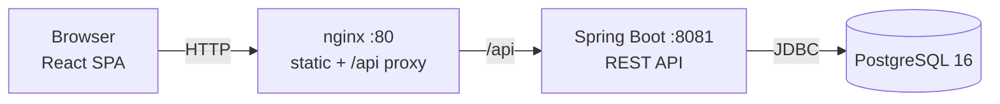

# SlangWord

A slang dictionary you can search, edit and quiz yourself on — Spring Boot REST API, React SPA, PostgreSQL, running from one command.

The dictionary ships with **7,641 real entries**, seeded from the original coursework data file.

---

## From coursework to platform

This repository started as a single-file Java Swing desktop app (`SlangDictionaryApp.java`, 350 lines) that read a backtick-delimited text file. It worked, and it is kept unchanged in [`legacy-swing/`](legacy-swing/) as the starting point.

The current version keeps the same domain and rebuilds it the way the problem would actually be solved in production:

| | Swing version | This version |
|---|---|---|
| Storage | `HashMap` + rewrite `slang.txt` on every change | PostgreSQL, Flyway migrations, JPA one-to-many |
| Access | One desktop user | REST API + web SPA, multi-user with JWT |
| History | In-memory list, lost on exit | Per-user, persisted, paginated |
| Duplicate word | Modal dialog | `409 Conflict`, `?overwrite=true` to confirm |
| Errors | `JOptionPane.showMessageDialog` | RFC 7807 `ProblemDetail` responses |
| Tests | None | 54 (23 unit, 31 integration with Testcontainers) + 8 frontend |
| Run it | `javac` and hope | `docker compose up` |

---

## Architecture



Backend layering — each layer depends only on the one below it, and business rules live in services so they can be tested without Spring:

```
web/          controllers, DTO mapping, @RestControllerAdvice
service/      business rules  ← unit-tested with Mockito
repository/   Spring Data JPA
domain/       JPA entities
security/     JWT filter, user details, entry point
config/       beans and @ConfigurationProperties
```

## Tech stack

| Layer | Choices |
|---|---|
| Backend | Java 21, Spring Boot 3.3, Spring MVC, Spring Data JPA, Spring Security, JJWT, Flyway, springdoc-openapi, Maven |
| Database | PostgreSQL 16 |
| Frontend | React 19, TypeScript, Vite, Tailwind CSS, TanStack Query, React Router, axios |
| Testing | JUnit 5, Mockito, Testcontainers, MockMvc, Vitest, React Testing Library |
| Infrastructure | Docker, Docker Compose, nginx, GitHub Actions |

## Quick start

Only Docker is required.

```bash
docker compose up --build
```

| What | Where |
|---|---|
| Web app | http://localhost:8080 |
| Swagger UI | http://localhost:8080/swagger-ui.html |
| OpenAPI document | http://localhost:8080/v3/api-docs |
| Health | http://localhost:8080/actuator/health |

Port 8080 already taken? `WEB_PORT=8090 docker compose up --build`.

First boot seeds all 7,641 words, which takes a few seconds; the `web` container waits for the API's healthcheck before it starts.

## API

| Method | Path | Auth | Notes |
|---|---|---|---|
| `POST` | `/api/auth/register` | — | 409 if the username is taken |
| `POST` | `/api/auth/login` | — | 401 on bad credentials |
| `GET` | `/api/slang-words` | — | `q`, `field=word\|definition`, `page`, `size` |
| `GET` | `/api/slang-words/{word}` | — | 404 if absent |
| `GET` | `/api/slang-words/random` | — | |
| `POST` | `/api/slang-words` | USER | 409 unless `?overwrite=true` |
| `PUT` | `/api/slang-words/{word}` | USER | replaces the definition list |
| `DELETE` | `/api/slang-words/{word}` | USER | 204 |
| `GET` | `/api/quiz` | — | `mode=word-from-definition\|definition-from-word` |
| `POST` | `/api/quiz/answer` | USER | grades and records the attempt |
| `GET` | `/api/history` | USER | own searches, newest first |
| `GET` | `/api/history/quiz-stats` | USER | answered, correct, accuracy |
| `DELETE` | `/api/history` | USER | clears own history |
| `POST` | `/api/admin/reset` | ADMIN | wipe and re-seed from `slang.txt` |

Searching while signed in records the keyword and its result count; anonymous searches record nothing.

### Example

```bash
curl -s 'http://localhost:8080/api/slang-words?q=excavator&field=definition'
```

```json
{
  "content": [
    { "id": 4260, "word": "JCB", "definitions": ["J C Bamford", "excavator manufacturer"] }
  ],
  "page": 0, "size": 20, "totalElements": 1, "totalPages": 1, "last": true
}
```

## Local development

Backend (needs JDK 21 and a database):

```bash
docker compose up -d db
cd backend && mvn spring-boot:run
```

Frontend (Vite proxies `/api` to `localhost:8081`):

```bash
cd frontend && npm install && npm run dev
```

### No JDK installed?

Every Maven command also runs in a container:

```bash
docker run --rm -v "$PWD/backend":/app -v slangword-m2:/root/.m2 -w /app maven:3.9-eclipse-temurin-21 mvn verify
```

Integration tests additionally need the Docker socket:

```bash
docker run --rm -v "$PWD/backend":/app -v slangword-m2:/root/.m2 \
  -v /var/run/docker.sock:/var/run/docker.sock \
  -e TESTCONTAINERS_HOST_OVERRIDE=host.docker.internal \
  --add-host host.docker.internal:host-gateway \
  -w /app maven:3.9-eclipse-temurin-21 mvn verify
```

## Tests

```bash
cd backend  && mvn verify          # 23 unit + 31 integration
cd frontend && npm test -- --run   # 8 component tests
```

Backend integration tests start a real PostgreSQL 16 through Testcontainers, run Flyway against it and drive the API through MockMvc — including the auth flow, pagination, and every 401/403/404/409 path.

## Project layout

```
backend/       Spring Boot API
frontend/      React SPA
legacy-swing/  the original coursework app, unchanged
docs/          design spec and implementation plan
.github/       CI workflow
```

## Design notes

- **The dictionary is seeded, not migrated.** Flyway owns the schema only; `SeedService` parses `slang.txt` at startup when the table is empty. The same routine backs `POST /api/admin/reset`, which is the REST equivalent of the Swing app's Reset button.
- **A word owns a list of definitions.** The source data has entries such as ``JCB`J C Bamford | excavator manufacturer``, so definitions are a child table rather than one text column.
- **The quiz is stateless.** A question carries its own answer and the client echoes it back, so no server-side question store is needed. A determined client could cheat; for a dictionary quiz the honest score is the user's own.
- **401 versus 403.** Spring Security's stateless default answers 403 to anonymous requests. A custom entry point restores the REST convention: 401 when nobody is authenticated, 403 when the caller is authenticated but not permitted.

Full design rationale in [`docs/superpowers/specs/`](docs/superpowers/specs/); the task-by-task build plan is in [`docs/superpowers/plans/`](docs/superpowers/plans/).
